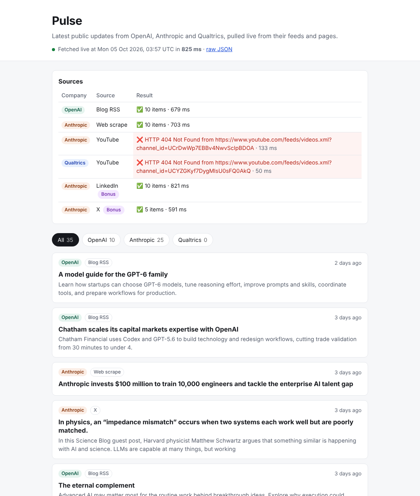

# Pulse

Pulse shows the latest public updates from **OpenAI**, **Anthropic** and **Qualtrics** on one page, newest first, each linking back to its source.
Every item is fetched live over HTTP when the page loads. Nothing is cached, stored, pasted in or generated.

**Live:** https://pulse.3minbite.online  ·  raw data: [`/api/updates`](https://pulse.3minbite.online/api/updates)

<!-- Screenshot of the hosted page, 5 Oct 2026. Replace docs/screenshot.png with a fresh one any time. -->


---

## 1. Run it locally

```bash
git clone https://github.com/Nit-inChaurasia/pulse.git
cd pulse
python -m venv .venv
source .venv/bin/activate        # Windows: .venv\Scripts\activate
pip install -r requirements.txt
python app.py                    # → http://localhost:5000
```

Python 3.10+ works (Vercel runs 3.12). There are no API keys, environment variables or database.

## 2. How fetching works

| Company | Source | Method | URL | Local | Vercel |
|---|---|---|---|---|---|
| OpenAI | News feed | RSS via `feedparser` | `https://openai.com/news/rss.xml` | ✅ 10 items | ✅ 10 items |
| Anthropic | News page | HTML scrape (`requests` + BeautifulSoup) | `https://www.anthropic.com/news` | ✅ 10 items | ✅ 10 items |
| Anthropic | YouTube | Atom feed via `feedparser` | `youtube.com/feeds/videos.xml?channel_id=UCrDwWp7EBBv4NwvScIpBDOA` | ✅ 10 items | ❌ HTTP 404 |
| Qualtrics | YouTube | Atom feed via `feedparser` | `youtube.com/feeds/videos.xml?channel_id=UCYZGKyf7DygMlsU0sFQ0AkQ` | ✅ 10 items | ❌ HTTP 404 |
| Anthropic *(bonus)* | LinkedIn | Plain GET, logged out | `https://www.linkedin.com/company/anthropicresearch/` | ✅ 10 posts | ✅ 10 posts |
| Anthropic *(bonus)* | X | Plain GET, logged out | `https://x.com/AnthropicAI` | ✅ 5 posts | ✅ 5 posts |

Statuses were checked on 5 Oct 2026. The page's status panel shows the live result on every load.

**How each source was found and checked.** Every URL was requested and its response inspected before any fetcher was written:

- **YouTube channel IDs** come from the `<link rel="canonical">` on each channel page: `@anthropic-ai`, and `user/QualtricsSoftware`, which is the channel qualtrics.com links to.
- **Qualtrics has no blog RSS.** `/blog/feed/`, `/articles/feed/`, `/news/feed.xml` and similar paths all return 404. `/rss.xml` responds, but it's a CMS dump of event-page templates, not posts, so YouTube is Qualtrics' source.
- **⚠️ YouTube on Vercel.** YouTube returns 404 for channel feeds when the request comes from a cloud or datacenter IP. The same URL returns 200 from a home connection. Both feeds are kept, and the error is shown honestly on the page. As a result, **Qualtrics currently has no items on the hosted version**; it has 10 when run locally.

## 3. Walkthrough of the fetch code

Everything lives in [`fetchers/`](fetchers):

| File | What it does |
|---|---|
| [`__init__.py`](fetchers/__init__.py) | `SOURCES` registry, plus `run_all()`, which fetches every source in parallel and merges the results |
| [`common.py`](fetchers/common.py) | `http_get()` (the one place the User-Agent and 6s timeout are set), plus date and summary normalisation |
| [`rss.py`](fetchers/rss.py) | `fetch_feed()`: one generic RSS/Atom fetcher, used for OpenAI and both YouTube channels |
| [`anthropic_news.py`](fetchers/anthropic_news.py) | `fetch_anthropic_news()`: scrapes the `<a href="/news/…">` cards |
| [`social.py`](fetchers/social.py) | `fetch_linkedin()` / `fetch_x()`: the bonus attempts |

**Where the HTTP requests happen:**

- `common.http_get()` makes every feed and scrape request: one `requests.get(url, headers=…, timeout=6)`.
- `social._get_public_page()` makes the LinkedIn and X requests. It calls `requests.get` itself so it can report *why* a platform blocked it (999, login redirect, empty body).

**How results are merged and sorted (`fetchers/__init__.py`):**

1. `run_all()` submits one `run_source()` per source to a `ThreadPoolExecutor` and waits at most 8.5s overall.
2. `run_source()` calls the fetcher inside `try/except`. A failure becomes `status: "error"` with a readable reason, so one broken site never breaks the page. On success it de-duplicates by URL, sorts newest first and keeps the top 10.
3. `run_all()` flattens every source's items, de-duplicates again and sorts.
4. `newest_first()` sorts by the ISO-8601 UTC string. One fixed format means text order equals time order, and items with no date sort as `""`, so they land at the bottom.

Every fetcher returns the same `SourceResult` shape (see `common.py`). The page and `/api/updates` both render exactly that.

## 4. LinkedIn & X: what I tried and what happened

These were attempted with a single plain `GET`, a browser User-Agent and **no cookies, login, API or scraping service**.

- **LinkedIn.** `GET /company/anthropicresearch/` returned **HTTP 200** with about 345 KB of HTML that already contains the 10 latest posts as `<article data-activity-urn="urn:li:activity:…">`. Posts only show relative dates ("1w"), so the exact date is decoded from the activity ID, whose top 41 bits are the creation time in ms. I checked this against the Anthropic enzyme post: the ID decodes to 23 Sep 2026, the same day as the news article. The code still handles the usual blocks (HTTP 999, `authwall` redirect). LinkedIn often serves those to datacenter IPs, so this source may flip to ❌ at any time.
- **X.** `GET /AnthropicAI` returned **HTTP 200** with server-rendered HTML holding the latest posts, followed by a "Log in or sign up" wall. The fetcher keeps top-level posts by @AnthropicAI only (reposts of other accounts are skipped) and decodes each date from the snowflake ID (`(id >> 22) + 1288834974657` ms).

Both are best-effort and labelled **Bonus** in the UI. If either platform changes its logged-out HTML, the status panel shows the precise reason instead.

## 5. Design decisions and trade-offs

- **RSS first, scraping second.** Feeds are a published contract: stable, dated and cheap to parse. Scraping (Anthropic's news page) depends on markup, so the scraper matches only stable hooks (the `href` prefix, `<time>`, "title" in the class name) and never the hashed CSS class names.
- **Parallel fetching.** The work is almost all waiting on the network. Threads overlap those waits, so a page load takes about as long as the slowest source (around 1–2s) rather than the sum. A hard 8.5s deadline keeps the page under ~10s even if a site hangs.
- **No caching.** The brief was "genuinely fetched at page load", and the header's "Fetched live at … in N ms" proves it. Responses send `Cache-Control: no-store`, so Vercel's CDN never serves a stale copy. The cost is extra load on sources and slower pages under traffic. A real product would cache for a few minutes.
- **Server-rendered.** Jinja plus plain CSS, with about 10 lines of JS for the filter tabs. There's no build step and nothing to break in a demo.
- **Zero-config Vercel.** Vercel's current Flask support auto-detects the `app` in `app.py`, so there's no `api/index.py` shim or legacy `builds`/`routes` config. `vercel.json` only sets `maxDuration`. The CSS sits in `public/static/`, because Vercel serves `public/` from its CDN while Flask serves the same path locally. It's one codebase for both.

## 6. How this was built

Directed with Claude Code: I wrote the brief, approved the plan, and approved each step that touched my accounts (GitHub, Vercel, DNS). Claude verified every source URL with live requests before writing the fetcher for it.

**What I reviewed and corrected:**

<!-- Add your notes here: what you checked, what you changed, what you'd push back on. -->
- _…_

## 7. What I'd add next

- **Scheduling.** A Vercel Cron job (or GitHub Action) that pulls every 15 minutes.
- **Change tracking.** Store seen URLs (e.g. Vercel KV / Postgres) so the page can show what's new since the last visit.
- **Alerts.** Email or Slack when a tracked company posts.
- **More sources.** A Qualtrics newsroom scrape (it works from cloud IPs, so it would fix the hosted gap), plus GitHub releases and podcast feeds.
- **Short caching.** A 2–5 minute cache to be polite to sources under real traffic.
